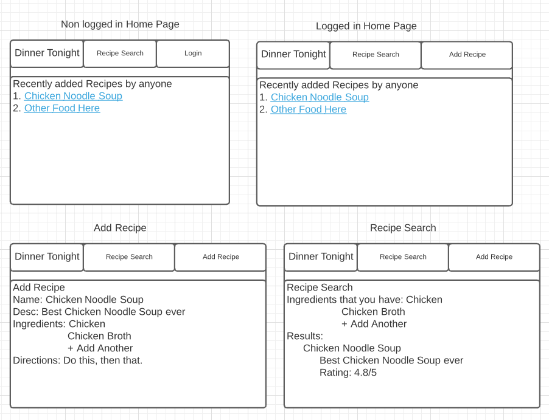
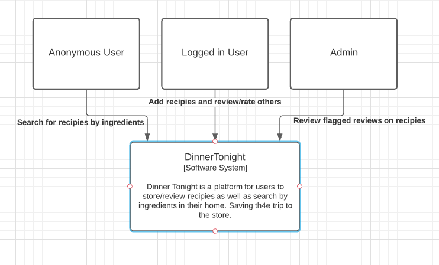
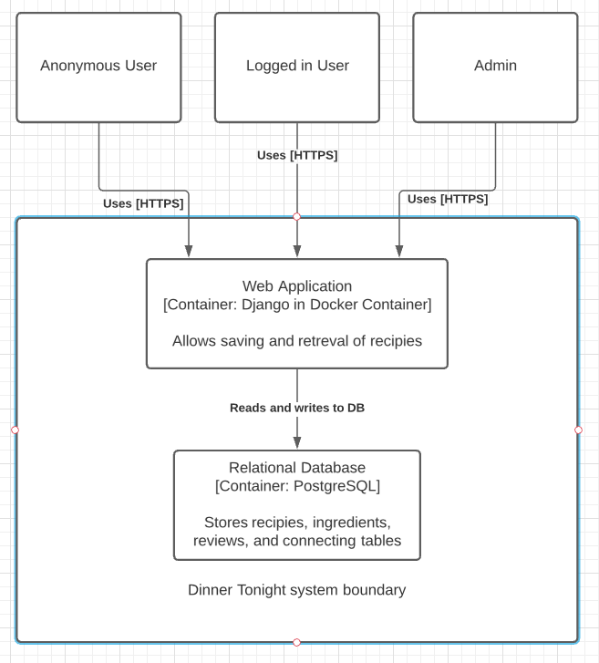
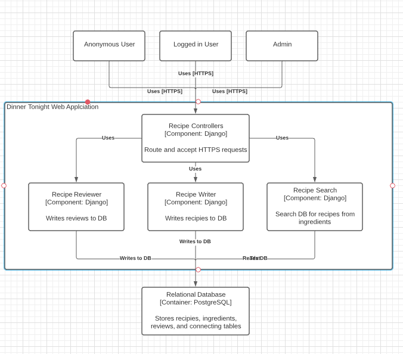

# DinnerTonight
This project will attract users by giving them the ability to search for recipes based on the ingredients they already have at home, possibly saving a trip to the grocery store! It will entice them with mouth watering meal descriptions and images. Additionally, they can create their own profile full of saved menu options and leave reviews and comment for any future recipe search.

## Installation
* First install docker.
* git clone https://github.com/ConnorPavlik/DinnerTonight

## Getting Started
```
cd <path to backend directory>
docker-compose build
docker-compose up
```

In a Separate Terminal:
```
docker-compose run django bash
```
```
python manage.py createsuperuser --username admin --email admin
exit
```

Access frontend from http://localhost/frontend/

## User Stories
1. As an hungry human, I want to search with ingredients that I have so I can quickly find a meal option with the ingredients that I already have available.

  - AC: search option must allow for up to 6 ingredients to be entered. Recipe search must result in options containing all of the entered items.

2. As an hungry human, I want to give my review/comments on the recipes I have made so I can help future users with picking an option.

  - AC: allow users to rate, write reviews recipes in the database. Allow all user to view this.

3. As an admin, I want to review flagged reviews for inappropriate or malicious content so that I can keep the site clean and user friendly.

  - AC: Allow admins to delete or make a review 'reviewed' if acceptable.

## Mis-User Stories  
1. As a troll, I want to write inappropriate or malicious text or post images that are not related to the recipe so that I lower the respect people have for DinnerTonight.

  - Mitigation: Other users can flag reviews to be reviewed by admins where the comment/review is scanned for malicious wording or imaging.

## Mockup

## Architecture Diagrams
  - Context
    
  - Containers
    
  - Components
    
# License
MIT License

Copyright (c) 2020 Connor Pavlik

Permission is hereby granted, free of charge, to any person obtaining a copy
of this software and associated documentation files (the "Software"), to deal
in the Software without restriction, including without limitation the rights
to use, copy, modify, merge, publish, distribute, sublicense, and/or sell
copies of the Software, and to permit persons to whom the Software is
furnished to do so, subject to the following conditions:

The above copyright notice and this permission notice shall be included in all
copies or substantial portions of the Software.

THE SOFTWARE IS PROVIDED "AS IS", WITHOUT WARRANTY OF ANY KIND, EXPRESS OR
IMPLIED, INCLUDING BUT NOT LIMITED TO THE WARRANTIES OF MERCHANTABILITY,
FITNESS FOR A PARTICULAR PURPOSE AND NONINFRINGEMENT. IN NO EVENT SHALL THE
AUTHORS OR COPYRIGHT HOLDERS BE LIABLE FOR ANY CLAIM, DAMAGES OR OTHER
LIABILITY, WHETHER IN AN ACTION OF CONTRACT, TORT OR OTHERWISE, ARISING FROM,
OUT OF OR IN CONNECTION WITH THE SOFTWARE OR THE USE OR OTHER DEALINGS IN THE
SOFTWARE.
